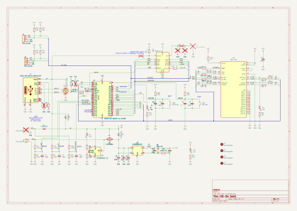

# H3S-Dev board for building Meshtastic nodes

### The new H3S-Dev design is now in pilot production!

#
## This project is being sponsored by [PCBWay](https://www.pcbway.com/)
### They offer a turnkey service to manufacture and assemble your printed circuit boards! The whole operation is fast and reliable since every single step is agreed between the customer and the responsible people from the factory. Every one detail is discussed as the components and materials used are agreed on at a high professional level.
#

### Specifications:
-  MCU:  ESP32-S3 with 8MB PSRAM
-  LoRa: RA-01SH-P with Power amplifier
-  GNSS: L96-M33 or similar
-  Power: USB-C and additional input (for example solar source) with separate sensing
-  LiPo battery management
-  I2C extension slots and soldering area
-  Credit card size 2-layer PCB
-  KiCad design open source hardware
#

### As a successor of our recent [H2S-Dev board](https://github.com/hobbyiot/LoRa-Nodes) the new hardware is compatible with both Meshtastic and Helium networks, ready to setup a simple node, sensor or tracker of your choice!

#

#
### Circuit schematic:

